# Instant Mildew Detector

* Instant Mildew Detector is a Predictive Analytics app that detects and predicts if cherry leaves are healthy or if they contain powdery mildew. The app is designed using the classificatiion model in machine learning. 

## Dataset Content

* The dataset is sourced from [Kaggle](https://www.kaggle.com/codeinstitute/cherry-leaves). We created then a fictitious user story where predictive analytics can be applied in a real project in the workplace.
* The dataset contains +4 thousand images taken from client's crop fields. The images show cherry leaves that are healthy and cherry leaves that contain powdery mildew, which is a fungal disease that affects a wide range of plants. The cherry plantation crop is one of their finest products in the portfolio and the company is concerned about supplying the market with a product of compromised quality.

## Business Requirements

The cherry plantation crop from Farmy & Foods is facing a challenge where their cherry plantations have been presenting powdery mildew. Currently, the process is to manually verify if a given cherry tree contains powdery mildew. An employee spends around 30 minutes in each tree, taking a few samples of tree leaves and verifying visually if the leaf tree is healthy or has powdery mildew. If it has powdery mildew, the employee applies a specific compound to kill the fungus. The time spent applying this compound is 1 minute.  The company has thousands of cherry trees located in multiple farms across the country. As a result, this manual process is not scalable due to time spent in the manual process inspection.

To save time in this process, the IT team suggested an ML system that is capable of detecting instantly, using a leaf tree image, if it is healthy or has powdery mildew. A similar manual process is in place for other crops for detecting pests, and if this initiative is successful, there is a realistic chance to replicate this project to all other crops. The dataset is a collection of cherry leaf images provided by Farmy & Foods, taken from their crops.

* 1 - The client is interested in conducting a study to visually differentiate a cherry leaf that is healthy and that contains powdery mildew.
* 2 - The client is interested to predict if a cherry leaf is healthy or contains powdery mildew.

## Rationale to map the business requirements to the Data Visualizations and ML tasks

* Business Requirement 1: Data Visualization

    * As a a client I want to display the "mean" and "standard deviation" images for cherry leaves that are healthy and cherry leaves that contain powdery mildew, so that I can visually differentiate cherry leaves. 
    * As a a client I want to display the difference between an average cherry leaf that is healthy and cherry leaf that contains powdery mildew, so that I can visually differentiate cherry leaves.
    * As a a client I want to display an image montage for cherry leaves that are healthy and cherry leaves that contain powdery mildew, so that I can visually differentiate cherry leaves.  

* Business Requirement 2:

    * As a client I want to predict if a given cherry leaf is a healthy or contains powdery mildew.
    * As a client I want to build a ML model and generate reports.

## Hypothesis and how to validate?
* List here your project hypothesis(es) and how you envision to validate it (them).

## ML Business Case
* In the previous bullet, you potentially visualized a ML task to answer a business requirement. You should frame the business case using the method we covered in the course.

## Dashboard Design

This application has five main sections. These sections are

* Quick Project Summary 

This page gives general information, the project dataset summary and the client's requirements.

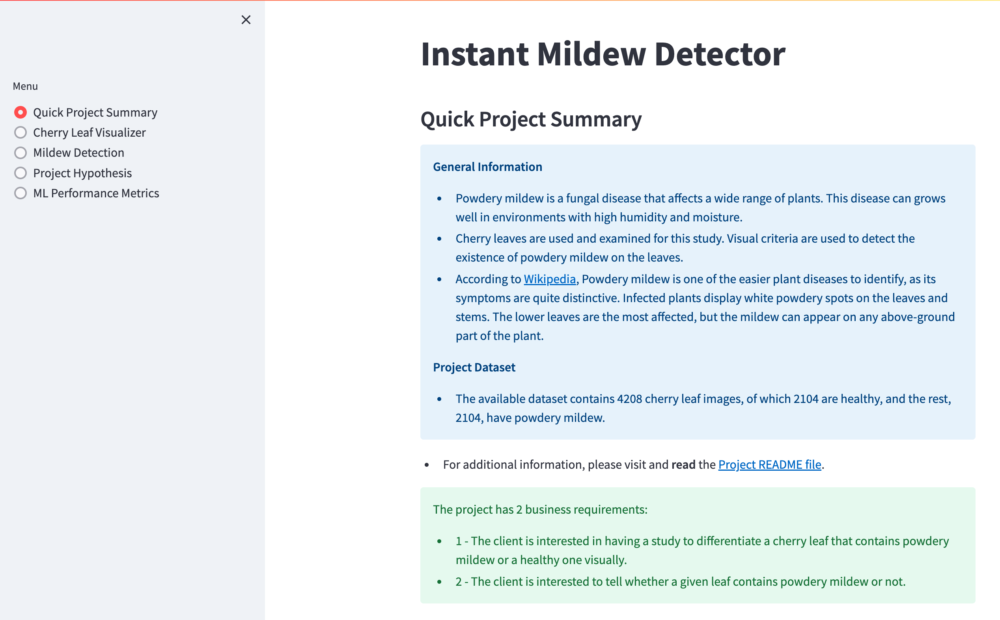

    
* Cherry Leaf Visualizer 

This page shows data visualization on three aspects.  The user can select either of the three check boxes at a time.

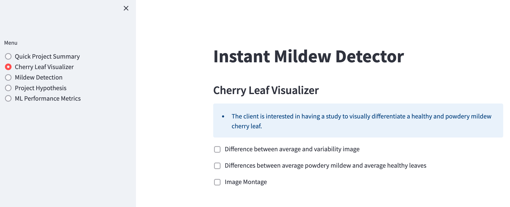
     
     1. Difference between average and variability image

     The first check box visualizes the "mean" and "standard deviation" images for powdery mildew contained and healthy leaf. 

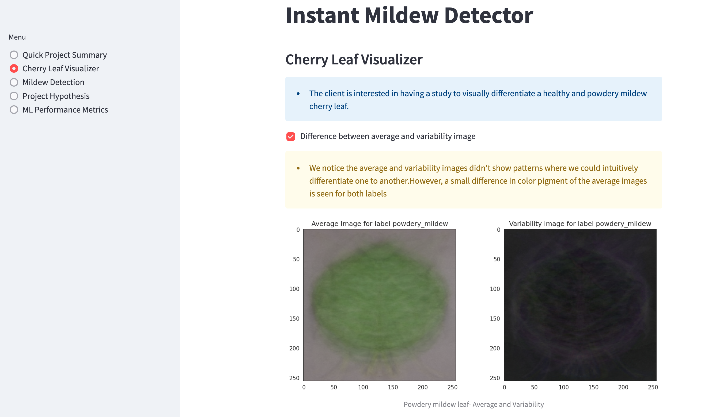

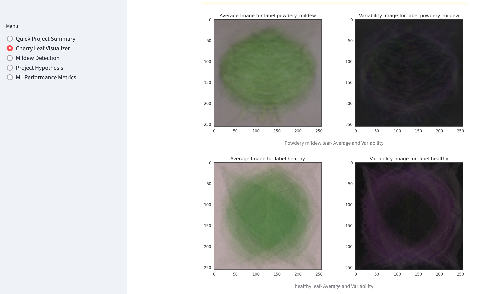

     2. The difference between average powdery mildew and healthy leaves.

     This checkbox displays an example of an average leaf containing powdery mildew, an average healthy leaf and a different image. 

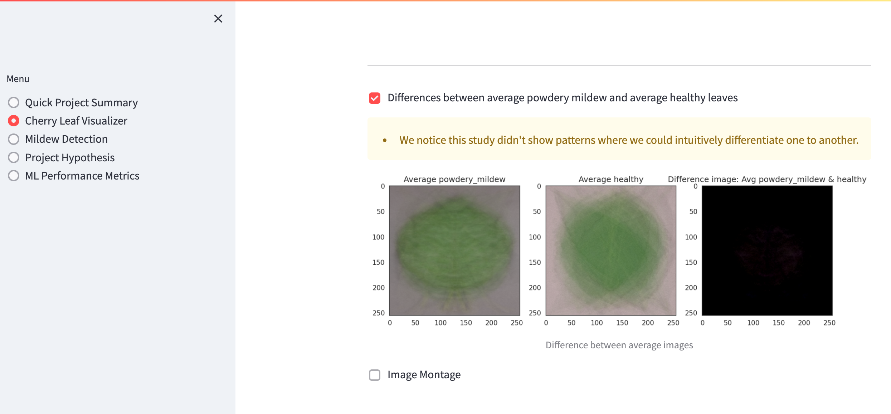

     3. An image montage for powdery mildew or healthy leaves.

     In the image montage check box the user is expected to choose a label between healthy or powdery mildew to create a montage of random pre labelled images. every time we click the image montage button it generates a new montage of random images. 

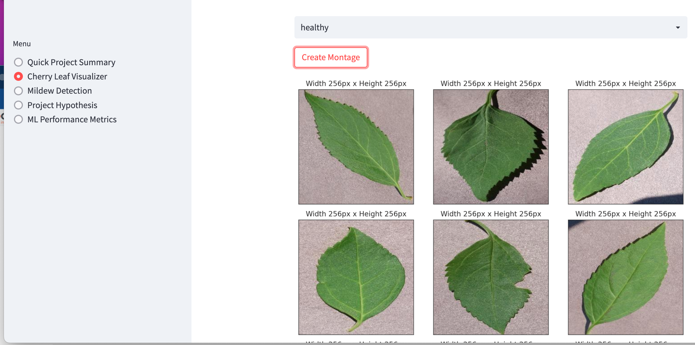

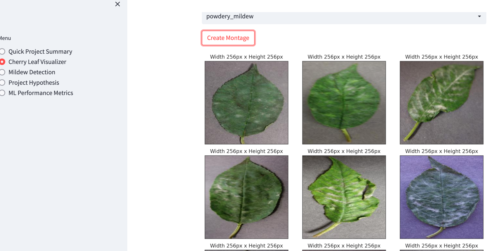

* Mildew Detection

     This page contains 

      * a link to download a set of cherry leaf images for live prediction (you may use the Kaggle repository that was provided to you).

listing of the findings related to a study to visually differentiate a cherry leaf that is healthy from one that contains powdery mildew

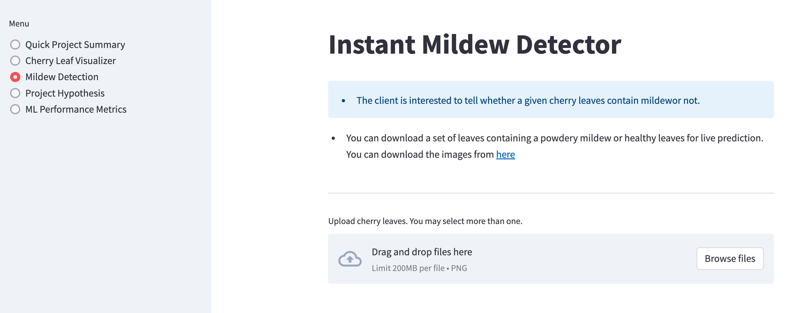

      *** a User Interface with a file uploader widget. The user should have the capacity to upload multiple images. For each image, it will display the image and a prediction statement, indicating if a cherry leaf is healthy or contains powdery mildew and the probability associated with this statement.
      *** A table with the image name and prediction results, and a download button to download the table.

* project Hypothesis 

     This page shows the project hypothesis and how it is validated across the project.

* Model performance Metrics

     This is a technical page which displays the model performance.

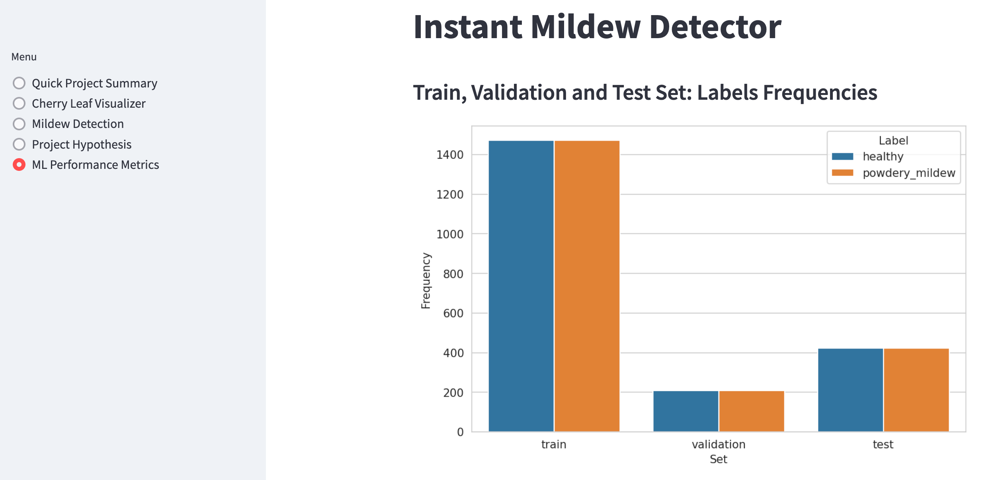

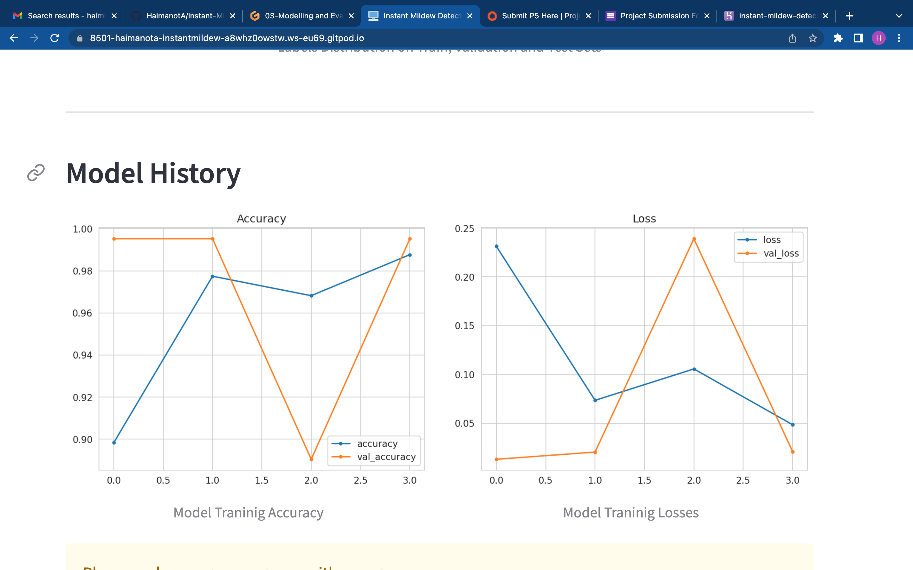

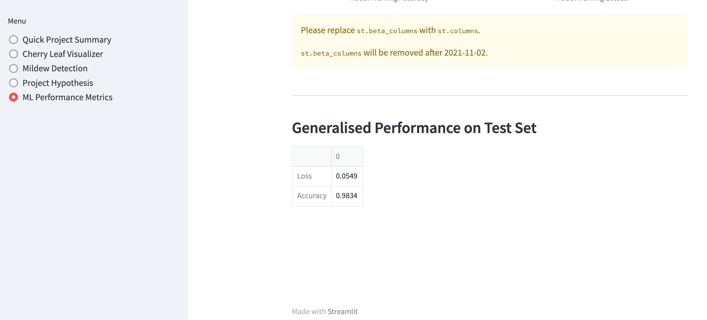

## Unfixed Bugs
* You will need to mention unfixed bugs and why they were not fixed. This section should include shortcomings of the frameworks or technologies used. Although time can be a big variable to consider, paucity of time and difficulty understanding implementation is not a valid reason to leave bugs unfixed.

## Deployment
### Heroku

* The App live link is: https://YOUR_APP_NAME.herokuapp.com/ 
* The project was deployed to Heroku using the following steps.

1. Log in to Heroku and create an App
2. At the Deploy tab, select GitHub as the deployment method.
3. Select your repository name and click Search. Once it is found, click Connect.
4. Select the branch you want to deploy, then click Deploy Branch.
5. The deployment process should happen smoothly in case all deployment files are fully functional. Click now the button Open App on the top of the page to access your App.

## Main Data Analysis and Machine Learning Libraries
* Numpy
* Pandas
* Matplotlib
* Seaborn
* Plotly
* Streamlit
* Scikit-learn
* tensorflow-cpu
* keras
* itertools
* random

## Credits 

* In this section you need to reference where you got your content, media and extra help from. It is common practice to use code from other repositories and tutorials, however, it is important to be very specific about these sources to avoid plagiarism. 
* You can break the credits section up into Content and Media, depending on what you have included in your project. 

### Content 

- The text for the Home page was taken from Wikipedia Article A
- Instructions on how to implement form validation on the Sign Up page was taken from [Specific YouTube Tutorial](https://www.youtube.com/)
- The icons in the footer were taken from [Font Awesome](https://fontawesome.com/)

### Media

- The photos used on the home and sign up page are from This Open Source site
- The images used for the gallery page were taken from this other open source site

## Acknowledgements (optional)
* 
