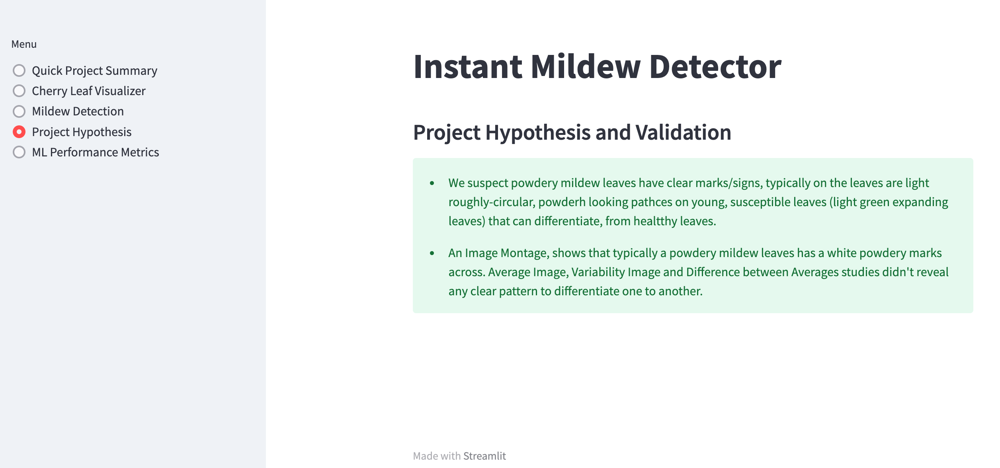

# Instant Mildew Detector

* Instant Mildew Detector is a Predictive Analytics app that detects and predicts if cherry leaves are healthy or if they contain powdery mildew. The input for this app is a cherry leaf image, and the output indicates whether the cherry leaf is healthy or has powdery mildew. The app assists clients in not supplying a compromised quality product to the market. 
* Instant Mildew Detector is designed using the classification model in machine learning. Therefore, it suggests a binary classifier, indicating whether a particular cherry leaf is healthy or contains powdery mildew.

## Dataset Content

* The dataset is sourced from [Kaggle](https://www.kaggle.com/codeinstitute/cherry-leaves). We created then a fictitious user story where predictive analytics can be applied in a real project in the workplace.
* The dataset contains +4 thousand images taken from client's crop fields. The images show cherry leaves that are healthy and cherry leaves that contain powdery mildew, which is a fungal disease that affects a wide range of plants. The cherry plantation crop is one of their finest products in the portfolio and the company is concerned about supplying the market with a product of compromised quality.

## Business Requirements

The cherry plantation crop from Farmy & Foods is facing a challenge where their cherry plantations have been presenting powdery mildew. Currently, the process is to manually verify if a given cherry tree contains powdery mildew. An employee spends around 30 minutes in each tree, taking a few samples of tree leaves and verifying visually if the leaf tree is healthy or has powdery mildew. If it has powdery mildew, the employee applies a specific compound to kill the fungus. The time spent applying this compound is 1 minute.  The company has thousands of cherry trees located in multiple farms across the country. As a result, this manual process is not scalable due to time spent in the manual process inspection.

To save time in this process, the IT team suggested an ML system that is capable of detecting instantly, using a leaf tree image, if it is healthy or has powdery mildew. A similar manual process is in place for other crops for detecting pests, and if this initiative is successful, there is a realistic chance to replicate this project to all other crops. The dataset is a collection of cherry leaf images provided by Farmy & Foods, taken from their crops.

* 1 - The client is interested in conducting a study to visually differentiate a cherry leaf that is healthy and that contains powdery mildew.
* 2 - The client is interested to predict if a cherry leaf is healthy or contains powdery mildew.

## Rationale to map the business requirements to the Data Visualizations and ML tasks

* Business Requirement 1: Data Visualization

    * As a a client I want to display the "mean" and "standard deviation" images for cherry leaves that are healthy and cherry leaves that contain powdery mildew, so that I can visually differentiate cherry leaves. 
    * As a a client I want to display the difference between an average cherry leaf that is healthy and cherry leaf that contains powdery mildew, so that I can visually differentiate cherry leaves.
    * As a a client I want to display an image montage for cherry leaves that are healthy and cherry leaves that contain powdery mildew, so that I can visually differentiate cherry leaves.  

* Business Requirement 2:

    * As a client I want to predict if a given cherry leaf is a healthy or contains powdery mildew.
    * As a client I want to build a ML model and generate reports.

## Hypothesis and how to validate?

* We suspect powdery mildew leaves have clear marks/signs; typically, the leaves are light roughly-circular, powders-looking patches on young, susceptible leaves (light green expanding leaves) that can differentiate from healthy leaves.

* An Image Montage shows that typically powdery mildew leaves have fine white marks across. Average Image, Variability Image, and Difference between Averages studies didn't reveal any clear pattern to differentiate one from another

## Dashboard Design

This application has five main sections. These sections are
 

**1. Quick Project Summary**

This page gives general information, the project dataset summary and the client's requirements.

    
* Cherry Leaf Visualizer 

This page shows data visualization on three aspects.  The user can select either of the three check boxes at a time.

     
1. Difference between average and variability image

The first check box visualizes the "mean" and "standard deviation" images for powdery mildew contained and healthy leaf. 

 2. The difference between average powdery mildew and healthy leaves.

This checkbox displays an example of an average leaf containing powdery mildew, an average healthy leaf and a different image. 

3. An image montage for powdery mildew or healthy leaves.

 In the image montage check box the user is expected to choose a label between healthy or powdery mildew to create a montage of random pre labelled images. every time we click the image montage button it generates a new montage of random images. 

**3. Mildew Detection**

This page contains 

* a link to download a set of cherry leaf images for live prediction (you may use the Kaggle repository that was provided to you).

* listing of the findings related to a study to visually differentiate a cherry leaf that is healthy from one that contains powdery mildew

* User Interface with a file uploader widget. The user should have the capacity to upload multiple images. For each image, it will display the image and a prediction statement, indicating if a cherry leaf is healthy or contains powdery mildew and the probability associated with this statement.
* A table with the image name and prediction results, and a download button to download the table.

If the user upload or drag and insert an image of a leaf with mildew, the prediction will look as follows. 

If the user upload or drag and insert an image of a healthy leaf, the prediction will look as follows. 

**4. Project Hypothesis** 

This page shows the project hypothesis and how it is validated across the project.

 **5. Model performance Metrics**

This is a technical page which displays the model performance and it contains three plots.

   1. Train, Validation and Test Set: Labels Frequencies

Out of the total 4208 datasets, 
 * The train set ratio is 0.7.
    * train - healthy: 1472 images. 
    * train - powdery_mildew: 1472 images
 * The validation set ratio is 0.1.
    * validation - healthy: 210 images
    * validation - powdery_mildew: 210 images
 * The test set ratio is 0.2. 
    * test - healthy: 422 images
    * test - powdery_mildew: 422 images

2. Model History

3. Generalised Performance on Test Set

The agreed degree of accuracy criteria for the performance goal of the predictions with the client 
is a degree of 97% accuracy. The generalized performance on the Test set for the 'Instant Mildew Detector' app is 98%. 

## Unfixed Bugs

* There are no unfixed bugs in this project.
* Shortcomings of the frameworks:- The plot generated in Model History regarding the Model accuracy and Model losses, both stories seem to be overfitted. This could be because I was supposed to train the data with more data sets.

## Deployment
### Heroku

* The App live link is: https://YOUR_APP_NAME.herokuapp.com/ 
* The project was deployed to Heroku using the following steps.

1. Log in to Heroku and create an App
2. At the Deploy tab, select GitHub as the deployment method.
3. Select your repository name and click Search. Once it is found, click Connect.
4. Select the branch you want to deploy, then click Deploy Branch.
5. The deployment process should happen smoothly in case all deployment files are fully functional. Click now the button Open App on the top of the page to access your App.

## Main Data Analysis and Machine Learning Libraries

* Numpy is used to handle multi-dimensional arrays and includes a wide set of mathematical functions to operate on these arrays. 
* Pandas is used for data analysis including performing statstical analysis. 
* Matplotlib is used for data visualization and helps in embedding plotts in Jupyter notebooks. 
* Seaborn provides a high-level intetrface for statstiical graphics and it offers a built-in themes for styling Matplot graphics. 
* Plotly is used for plotting data and and functions, add intteractivity and animation to data visualization. 
* Scikit-learn contain tools for predictive analysis. allows to train machine learning models for classification and clustetring. 
* tensorflow used to reduce the error in every iteration while fitting the model by using an optimiser and loss function.
* keras provides the python interface for artificial neural networks. 
* itertools used to iterate over data structures than can be sttepped over using a for-loop. 
* random is used to generate random numbers. 

## Credits 

* This app is built by forking the template proven by Code Institute and the codes are 
similar to the walkthrough project 1. 
* The description for data Analysis and Machine Learning Libraries are taken from the CI lecture notes/videos. 

### Content 

- The information regarding powdery mildew is taken from [Wikipedia](https://en.wikipedia.org/wiki/Powdery_mildew).

### Media

- The cherry leave images dataset are taken from [Kaggle](https://www.kaggle.com/codeinstitute/cherry-leaves).
